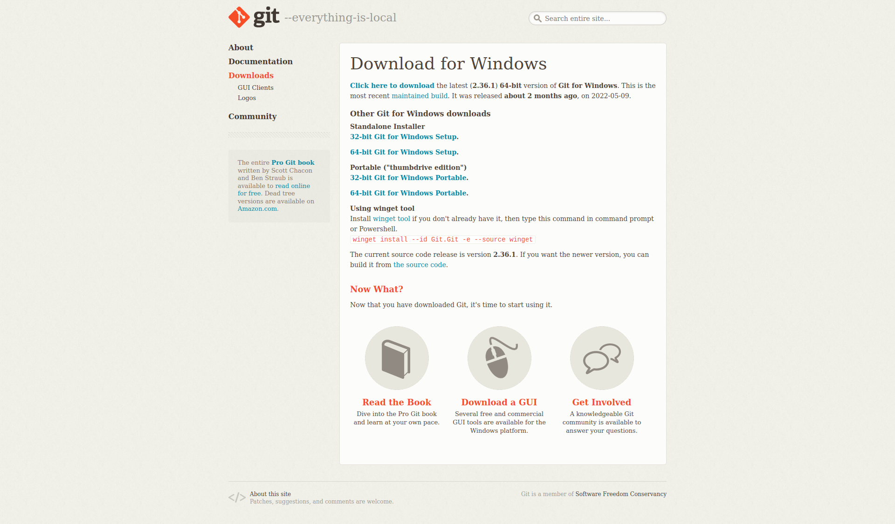
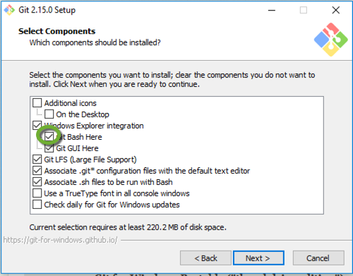
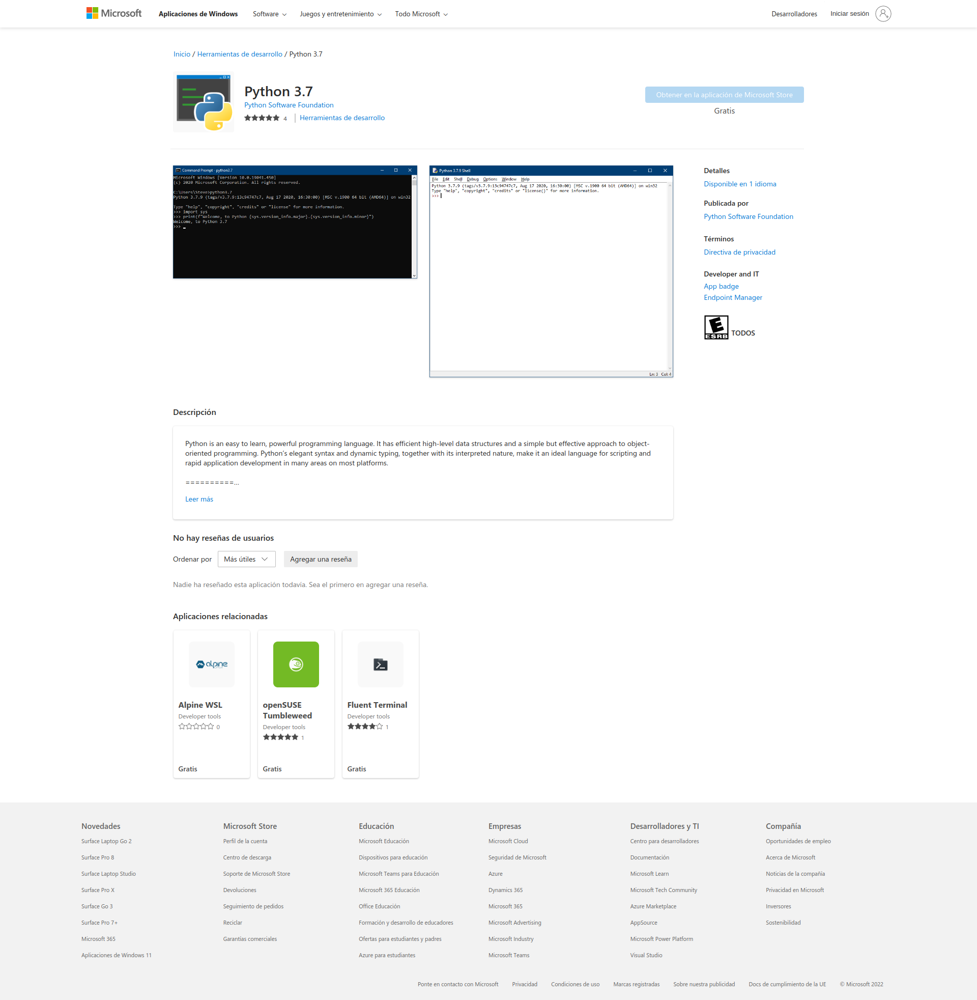
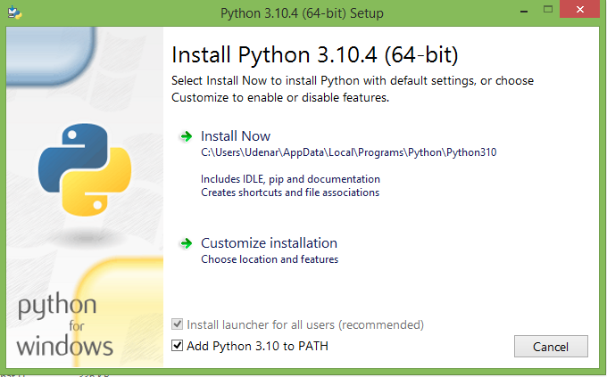
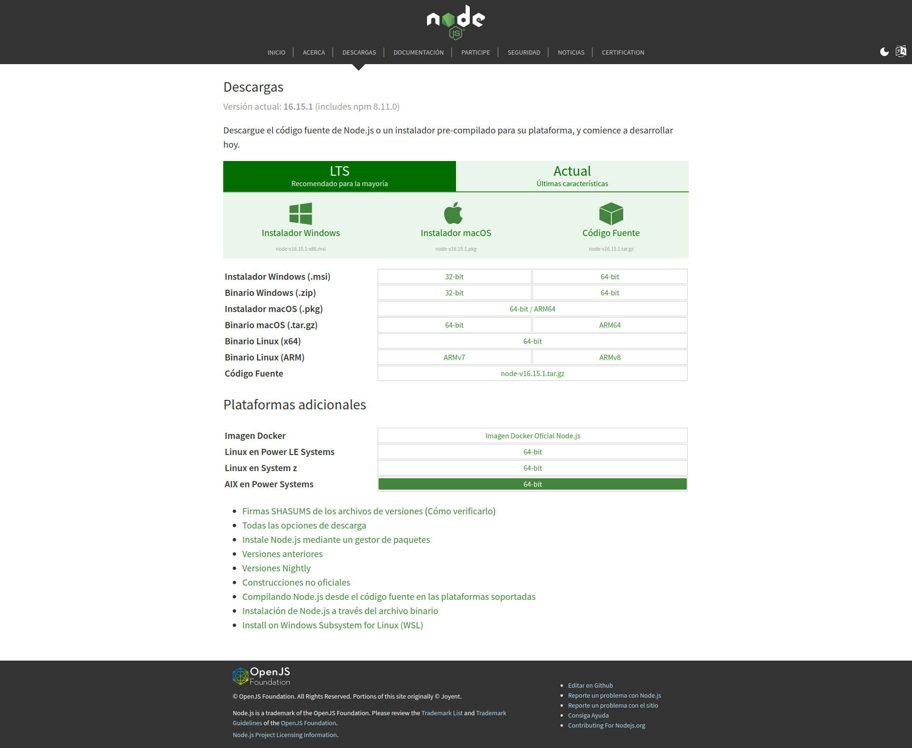
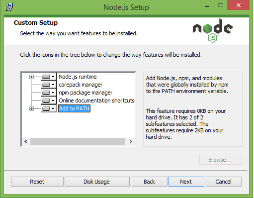
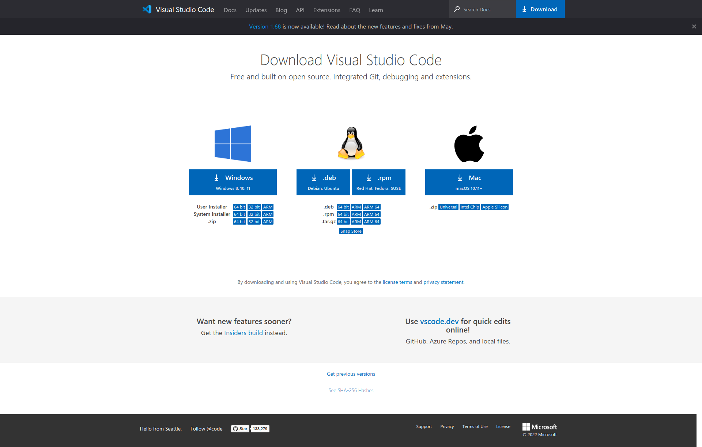

# Desarrollo de Sistemas de Medición Remota

# Setup

## Instalar Git

### Linux
```bash
sudo apt update
sudo apt install git
git --version

git version 2.34.1 # Success!
```

### MacOS
```bash
brew install git
git --version

git version 2.34.1 # Success!
```

### Windows
#### Utilizando Powershell
```powershell
winget install --id Git.Git -e --source winget
```
Descargar desde página oficial: 

https://git-scm.com/download/win



##### Instalar Git bash



##### O utilizar el emulador cmder (full con git)

https://cmder.net/


## Instalar Python

### Linux
```bash
sudo apt update
sudo apt install python python-dev python-pip
python --version

Python 3.10.4 # Success!
```
### MacOS
```bash
brew install python
python --version

Python 3.10.4 # Success!
```

### Windows
Instalar desde Microsoft Store:

https://apps.microsoft.com/store/detail/python-37/9NJ46SX7X90P?hl=es-co&gl=CO



O descargar desde sitio oficial (NO OLVIDAR AGREGAR LA RUTA DE INSTALACIÓN COMO VARIABLE DE ENTORNO):

https://www.python.org/downloads/windows/



Verificar la instalación en Powershell
```bash
python --version

Python 3.10.4 # Success!
```

## Instalar NodeJS

### Linux
```bash
curl -fsSL https://deb.nodesource.com/setup_18.x | sudo -E bash -
sudo apt-get install -y nodejs

node --version
v16.15.1 # Success
```

### MacOS
```bash
brew install node

node --version
v16.15.1 # Success
```

### Windows

Sitio Oficial:

https://nodejs.org/es/download/



Agregar como variable a PATH:



## Instalación Editor de Código VSCode

#### Descarga desde sitio oficial:

https://code.visualstudio.com/download



Verificar la instalación en Powershell
```bash
node --version

v16.15.1 # Success
```

##### Extensiones para optimizar la codificación

Extensión | Link
---------- | ----------
Python | https://marketplace.visualstudio.com/items?itemName=ms-python.python
Pylance | https://marketplace.visualstudio.com/items?itemName=ms-python.vscode-pylance
Intellicode | https://marketplace.visualstudio.com/items?itemName=VisualStudioExptTeam.vscodeintellicode

## Crear Entorno Virtual en Python

### Entorno Virtual

##### Unix (Linux - MacOS)
```bash
# Instalación
pip install virtualenv

# Crear Entorno
python -m virtualenv <name>

# Activar Entorno
source env/bin/activate

# Desactivar Entorno
deactivate
```
##### Windows
```bash
# Instalación
py -m pip install --user virtualenv

# Crear Entorno
py -m virtualenv <name>

# Activar Entorno
.\env\Scripts\activate

# Desactivar Entorno
deactivate
```

## Descargar Repositorio
```bash
git clone https://github.com/jsebas96/tutorial-campus-verde.git
```
## Instalar Librerías Necesarias
```bash
pip install -r requirements.txt 
```


