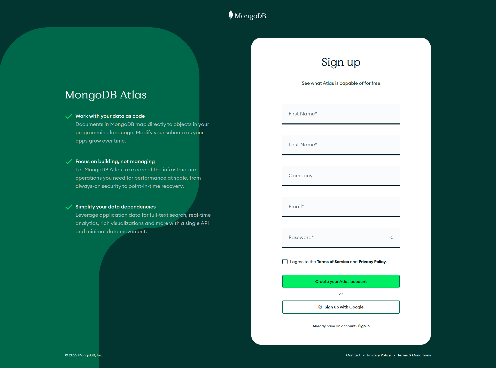
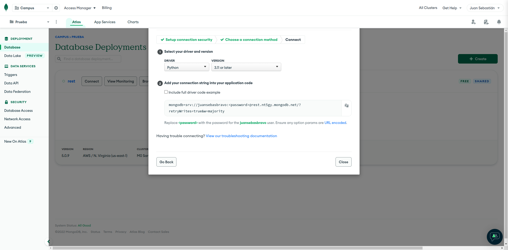

# Base de Datos

## Base de Datos de Tipo Documental 

https://www.ilimit.com/blog/base-de-datos-sql-nosql/

+ Son bases de datos versátiles que permiten agregar información o hacer cambios en el sistema sin necesidad de agregar configuraciones extras. 
+ Las bases de datos NoSQL open source no requieren del pago de licencia y no necesitan un hardware muy potente para poder ser ejecutadas. 
+ Soportan el crecimiento horizontal, es decir, al soportar estructuras distribuidas se pueden instalar nuevos nodos operativos que balancean la carga de trabajo. Es más fácil su expansión debido a este escalado horizontal. 
+ Permiten guardar datos de cualquier tipo, en cualquier momento, sin requerir una verificación. 
+ Realizan consultas utilizando JSON (JavaScript Object Notation, formato sencillo de intercambio de texto). 

## Estructura Base de datos Documental


## Utilizando MongoAtlas

### Registro

https://www.mongodb.com/cloud/atlas/register



### Crear Cluster


### Crear Usuario con Credenciales


### Autorizar Direcciones IP de Ingreso


Si se desea conectar desde cualquier IP, se configura la dirección como: 0.0.0.0/0

### Conectar Base de Datos en Aplicación



## Guardar Información en Base de Datos

### Setup cluster de mongo

```python
# Connect to the MongoDB server
db_client = MongoClient(config['MONGO_URI']) 
# Create the database
db_name = db_client['demo']
# Create the collection 
db_collection = db_name['electricMeter'] 
```

### Recepción de datos y guardar

```python
# On Data Received Callback
def on_message(client, userdata, msg):
    print(msg.topic + " " + str(msg.payload))
    # Convert from json to python
    data = json.loads(msg.payload)
    # Set date if not in data
    if "date" in data:
        data['date'] = datetime.fromtimestamp(data['date'])
    else:
        data['date'] = datetime.now()
    # Save document in collection
    db_collection.insert_one(data)
```
