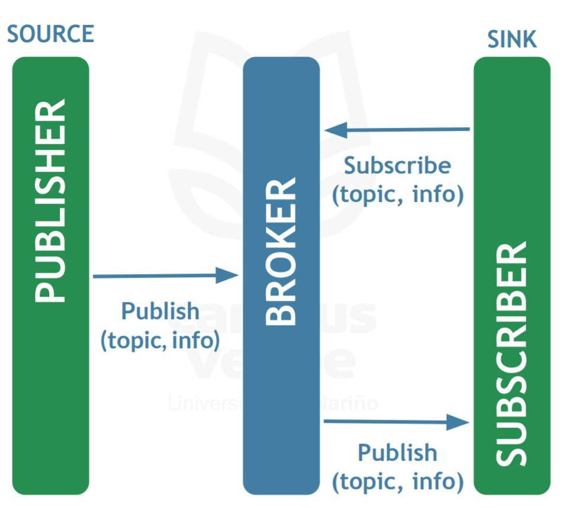
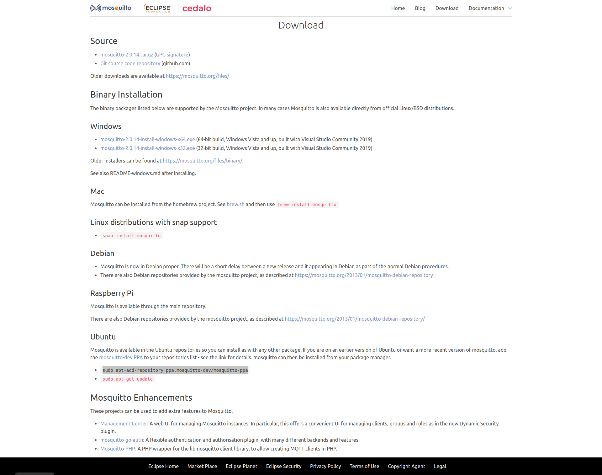

# Protocolo MQTT

**Tabla de Contenido**

[TOC]

## Protocolo MQTT



## Instalación de Broker con Mosquitto

### Linux
```bash
sudo apt-add-repository ppa:mosquitto-dev/mosquitto-ppa
sudo apt update
sudo apt install -y mosquitto mosquitto-clients
sudo systemctl start mosquitto
sudo systemctl status mosquitto

● mosquitto.service - Mosquitto MQTT v3.1/v3.1.1 Broker
     Loaded: loaded (/lib/systemd/system/mosquitto.service; enabled; vendor pr>
     Active: active (running) since Fri 2021-10-08 06:29:25 UTC; 12s ago
       Docs: man:mosquitto.conf(5)
             man:mosquitto(8)
# SUCCESS!

# BROKER SECURITY
sudo mosquitto_passwd -c /etc/mosquitto/passwd <username>

Password:
Reenter password:

# Create file default.conf
sudo nano /etc/mosquitto/conf.d/default.conf
    # Inside the file
    listener 1883
    password_file /etc/mosquitto/passwd
# Ctrl + O to save and Ctrl + X to exit

# Restart Broker
sudo systemctl restart mosquitto
```

### MacOS
```bash
brew install mosquitto
brew services start mosquitto
brew services status mosquitto

● mosquitto.service - Mosquitto MQTT v3.1/v3.1.1 Broker
     Loaded: loaded (/lib/systemd/system/mosquitto.service; enabled; vendor pr>
     Active: active (running) since Fri 2021-10-08 06:29:25 UTC; 12s ago
       Docs: man:mosquitto.conf(5)
             man:mosquitto(8)
# SUCCESS!
```

### Windows

#### Descargar de Página Oficial:

https://mosquitto.org/download/



## Enviar y Recibir Datos a través de MQTT

Para fines praćticos, se puede utilizar brokers de prueba en línea como el de HIVEMQ:

https://www.hivemq.com/public-mqtt-broker/

### Crear Cliente MQTT

```python
# Generate a random client ID
client_id = f'python-mqtt-{random.randint(0, 10000)}'
# Create a new MQTT client instance
client = mqtt_client.Client(client_id=client_id)
# Set credentials for connection
client.username_pw_set(
    username = config["USER"],
    password = config["PSSWD"]
)
```

### Enviar Trama de Datos
```python
# Create Data
data = json.dumps({'voltage': 120})
# Start Connection
client.connect(config["HOST"], int(config["PORT"]), keepalive=60)
# Send Data
client.publish('<topic>', data)

client.disconnect()
```

### Recibir Datos
```python
# Receive Data
'''
    DEFINE CALLBACKS TO RECEIVE DATA
'''
# Connection Callback
def on_connect(client, userdata, flags, rc):
    print("Connected with result code " + str(rc))
    client.subscribe("<topic>")
# On Data Received Callback
def on_message(client, userdata, msg):
    print(msg.topic + " " + str(msg.payload))
```